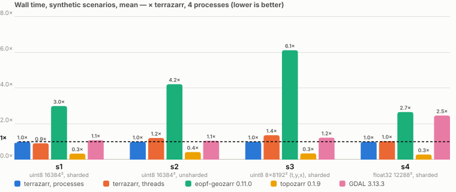
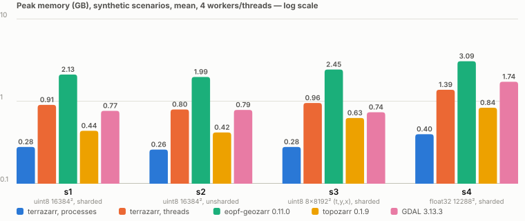
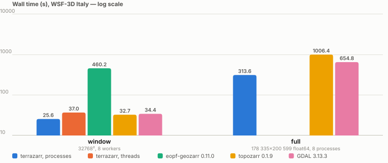
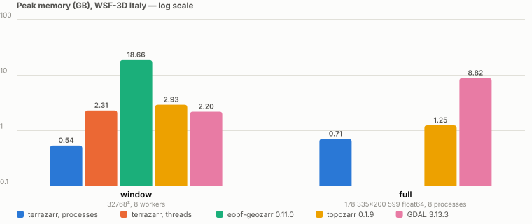

# Benchmarks

terrazarr against the three other open-source writers of GeoZarr multiscale pyramids, on the
same inputs, the same machine and the same settings wherever a writer takes them. Every number
here is reproducible from the public data and the scripts in `bench/` (see
[Reproducibility](#reproducibility)); the raw JSON and logs behind the tables are published next
to the data.

## Data

### Synthetic scenarios

Four rasters generated by `bench/synth.py`, each with a diagonal band of nodata and an all-nodata block
in a corner so that nodata handling is exercised; the inputs are zarr v3 stores with 1024² chunks.

| scenario | array | dtype | output | scenario's own method |
|---|---|---|---|---|
| s1 | 16384 × 16384 | uint8 | sharded, 256² chunks in 4096² shards | min, nodata 0 |
| s2 | 16384 × 16384 | uint8 | unsharded, 256² chunks | mean, nodata 0 |
| s3 | 8 × 8192 × 8192 (t, y, x) | uint8 | sharded | mean, nodata 0 |
| s4 | 12288 × 12288 | float32 | sharded | median, NaN nodata |

Every writer runs every scenario with `mean`, the one reduction all four offer; terrazarr is run
a second time with the scenario's own method where that differs.

### WSF-3D Italy

The World Settlement Footprint 3D layer 2024 over Italy (DLR, CC BY 4.0): building height in metres,
178 335 × 200 599 float64 pixels at 0.0000898° (about 10 m), 1.3 % of them non-zero. Two extents:

- the **32768² window** at row 73 728, column 77 824 (Tuscany to Lazio), 8.6 GB uncompressed,
  used for the runs that every writer can finish in minutes;
- the **full raster**, 286 GB uncompressed, 1.87 GB as a 2048²-chunked zarr, the case the
  writers were built for or not.

The pyramids are written with 256² chunks in 4096² shards, `mean`, nodata 0, ten levels
(eight for the window) down to 256 px. The reference for the value comparisons is the pyramid
under `reference/`, written once with the nodata rule of terrazarr by its first, unoptimised
version and kept fixed since; the test suite checks that rule against a direct numpy reduction,
and the tables show that the current terrazarr reproduces the reference bit for bit.

### Where the data is

All inputs, the reference pyramids and the raw results are public, anonymous reads, under
`s3://me-public-assets/terrazarr/` (eu-central-1), also at
`https://me-public-assets.s3.eu-central-1.amazonaws.com/terrazarr/<key>`:

| key | what | license |
|---|---|---|
| `synthetic/s1..s4.zarr` | the synthetic inputs | Apache-2.0 |
| `inputs/WSF3Dv3_Italy_full.zarr/` | WSF-3D Italy, 2048²-chunked zarr v3, 1.87 GB | CC BY 4.0 |
| `inputs/WSF3Dv3_Italy_win32k.zarr/` | the 32768² window, same layout, 162 MB | CC BY 4.0 |
| `inputs/WSF3Dv3_Italy_striped.tif`, `inputs/WSF3Dv3_Italy_cog.tif` and the window variants | the same raster as the source striped GeoTIFF and as a COG | CC BY 4.0 |
| `reference/italy_full_baseline.zarr/`, `reference/win32k_baseline.zarr/` | pyramids of the original module, used as cross-checks | CC BY 4.0 |
| `demo/WSF3Dv3_Italy.zarr/` | the terrazarr pyramid of the full raster behind the [demo](demo.md) | CC BY 4.0 |
| `results/` | JSON and logs of every run in this page | Apache-2.0 |

```bash
.venv/bin/python bench/fetch_data.py          # synthetic, window inputs, window reference: about 2 GB
.venv/bin/python bench/fetch_data.py --full   # plus the full-Italy input and reference: 9 GB more
```

### Machine

One machine for every number: 24 cores, 43 GB RAM, local NVMe, Ubuntu 22.04, Python 3.11 for
terrazarr and 3.12 where a writer requires it. Inputs and outputs on the local disk. Wall times
vary by about ±5 % between repeats and more when the machine is shared, which the notes say
when it happened; peak memory, object counts and store traffic are stable.

## Writers

| writer | version | how it was run |
|---|---|---|
| terrazarr | this release | `terrazarr` CLI settings above, 8 single-threaded worker processes (or 8 threads where stated) |
| eopf-geozarr | 0.11.0, installed from the `v0.11.0` tag of [EOPF-Explorer/data-model](https://github.com/EOPF-Explorer/data-model) | `create_geozarr_dataset(spatial_chunk=4096, min_dimension=256, enable_sharding=True)` with the data under a child group, since a root-only tree writes nothing; 8 dask threads for level 0 |
| topozarr | 0.1.9 | `create_pyramid(levels, method="mean").write(max_workers=8)`, source opened lazily as its documentation advises |
| GDAL | 3.13.3, official Docker image | `gdal_translate -of ZARR -co FORMAT=ZARR_V3 -co BLOCKSIZE=256,256 -co COMPRESS=ZSTD`, then `gdaladdo -r average` for the overviews, `GDAL_NUM_THREADS=8` |

How they differ, from their sources at these versions:

| | terrazarr | eopf-geozarr 0.11.0 | topozarr 0.1.9 | GDAL 3.13.3 |
|---|---|---|---|---|
| execution | lazy dask graph, one task per output shard, level 0 in windows | level 0 lazy through dask `to_zarr`; every overview from the whole previous level as one numpy array (`ds[var].values`) | own thread pool over shard-aligned regions and a Rust reduce kernel, no dask | block-cached single process |
| level 1 | inside the level-0 write task | whole level 0 in numpy | fused into the level-0 copy when the upper levels fit in RAM, else read back from the store | a `gdaladdo` pass over level 0 |
| levels ≥ 2 | parent shards read from the store, four per task | whole previous level in numpy | previous level read back from the store | each pass from the previous overview |
| memory | one parent shard and its output per task | the whole level, about twice | workers × a few regions | block cache plus overview buffers |
| nodata in overviews | numeric nodata excluded from the mean, block blanked below 30 % valid, NaN always nodata | NaN propagates; a numeric nodata is not exposed by the API and its reducer is called without one, so zeros are averaged in | NaN-aware fill; zeros averaged in | a numeric zarr fill value is honoured as nodata, NaN fill averages zeros in |
| overview dtype | the source dtype, integers rounded | float64 whatever the source | the source dtype, integers truncated | the source dtype, rounded |
| overview size | trimmed (`floor`), pixel size exactly `2**L` × native | trimmed; per-level transform derived from the native bounds and the trimmed shape | trimmed | rounded up, extent stretched over the rounded size |
| chunk and shard | chosen by the caller | shard `spatial_chunk`, chunk its own choice | chosen by it: 512 KB chunks, up to 4 per shard, snapped to the source | `BLOCKSIZE` chunk, no shards in the classic API |
| level layout | groups `0`, `1`, … | the group itself is level 0, overviews `r2`, `r4`, … | groups `0`, `1`, … | root array plus `ovr_2x`, `ovr_4x`, … |
| metadata | zarr-conventions multiscales, proj and spatial, plus a tile matrix set; CRS on every level | zarr-conventions multiscales and spatial; CRS on every level | zarr-conventions multiscales, proj and spatial | zarr-conventions multiscales only |
| resume | per-window markers, an interrupted run finishes | per-band validation and retry | none | none |

## Results

Wall time is the whole run from the `time` wrapper (process start to exit, including the writers'
own start-up); CPU is the wrapper's average utilisation, `container` where the writer ran in
Docker and only its cgroup memory was polled; peak RSS is the maximum resident set of the
process tree, with the dask workers of terrazarr and eopf-geozarr included. Object counts are
covered in the notes below the tables.

### Synthetic scenarios, mean, 4 workers or threads




CPU utilisation and object counts aren't in the charts; the table below each scenario has the
full precision.

#### s1: uint8 16384², sharded

| writer | wall [s] | CPU | peak RSS [GB] |
|---|---:|---:|---:|
| terrazarr, 4 processes | 14.0 | 264 % | 0.28 |
| terrazarr, 4 threads | 12.8 | 172 % | 0.91 |
| eopf-geozarr 0.11.0 | 42.0 | 157 % | 2.13 |
| topozarr 0.1.9 | 4.7 | 408 % | 0.44 |
| GDAL 3.13.3 | 15.2 | container | 0.77 |
| terrazarr, 4 processes, `min` | 13.2 | 274 % | 0.30 |

#### s2: uint8 16384², unsharded

| writer | wall [s] | CPU | peak RSS [GB] |
|---|---:|---:|---:|
| terrazarr, 4 processes | 14.7 | 277 % | 0.26 |
| terrazarr, 4 threads | 17.8 | 158 % | 0.80 |
| eopf-geozarr 0.11.0 | 62.1 | 141 % | 1.99 |
| topozarr 0.1.9 | 6.2 | 341 % | 0.42 |
| GDAL 3.13.3 | 15.5 | container | 0.79 |

#### s3: uint8 8×8192² (t, y, x), sharded

| writer | wall [s] | CPU | peak RSS [GB] |
|---|---:|---:|---:|
| terrazarr, 4 processes | 15.8 | 303 % | 0.28 |
| terrazarr, 4 threads | 21.6 | 150 % | 0.96 |
| eopf-geozarr 0.11.0 | 96.8 | 161 % | 2.45 |
| topozarr 0.1.9 | 5.5 | 672 % | 0.63 |
| GDAL 3.13.3 | 19.4 | container | 0.74 |

#### s4: float32 12288², sharded

| writer | wall [s] | CPU | peak RSS [GB] |
|---|---:|---:|---:|
| terrazarr, 4 processes | 15.8 | 246 % | 0.40 |
| terrazarr, 4 threads | 16.3 | 137 % | 1.39 |
| eopf-geozarr 0.11.0 | 42.1 | 339 % | 3.09 |
| topozarr 0.1.9 | 4.5 | 404 % | 0.84 |
| GDAL 3.13.3 | 39.0 | container | 1.74 |
| terrazarr, 4 processes, `median` | 21.6 | 302 % | 0.76 |

### WSF-3D Italy, window and full




#### 32768² window

| writer | wall [s] | CPU | peak RSS [GB] |
|---|---:|---:|---:|
| terrazarr, 8 processes | 25.6 | 728 % | 0.54 |
| terrazarr, 8 threads | 37.0 | 251 % | 2.31 |
| eopf-geozarr 0.11.0 | 460.2 | 382 % | 18.66 |
| topozarr 0.1.9 | 32.7 | 359 % | 2.93 |
| GDAL 3.13.3 | 34.4 | container | 2.20 |

#### Full

| writer | wall [s] | CPU | peak RSS [GB] |
|---|---:|---:|---:|
| terrazarr, 8 processes | 313.6 | 1427 % | 0.71 |
| eopf-geozarr 0.11.0 | stopped after 42 min | – | – |
| topozarr 0.1.9 | 1006.4 | 364 % | 1.25 |
| GDAL 3.13.3 | 654.8 | container | 8.82 |


- **topozarr** is the fastest writer on data that fits in RAM: its fused
level-0 copy and Rust reduce kernel finish the synthetic scenarios in 4.5 to 6 s and the 8.6 GB WSF-3D window in 32.7 s. 
- **terrazarr** trails it closely at a fraction of the memory (13 to 22 s and 26 s, at half topozarr's peak RSS or less) and that gap flips as the input stops fitting in RAM. terrazarr's peak memory is set by its window size, not by the dataset, so it stays at 0.3 to 0.9 GB from the smallest synthetic raster up to the full 286 GB, 36-billion-pixel WSF-3D Italy: 314 s at 0.71 GB, barely more than on the window. topozarr, whose speed depends on levels
fitting in RAM, takes 1006 s on the same raster, 3× terrazarr's time, once it has to fall back to
reading levels back from the store; GDAL finishes in 655 s at 8.8 GB, 12× terrazarr's memory.
- **eopf-geozarr**, which needs the whole previous level as one numpy array per overview, cannot finish it at all: given a 30 GB cap, it pinned at that cap after 42 minutes, one core busy,
without writing a single data chunk, since level 0 alone is 286 GB, more than six times this
machine's RAM. 

In short: topozarr wins on raw speed while the data fits in memory; terrazarr is
the one that scales, because its memory use doesn't grow with the dataset at all.

## Scaling

The memory of a writer that builds one dask graph for level 0 grows with the number of shard
tasks, not with the pixel count: measured on metadata-only inputs, the main process needs about
40 KB per level-0 shard task, linear from 64 to 65 536 tasks. A 2.26 M × 2.19 M four-band image
at 4096² shards is 1.18 million such tasks, 45 to 55 GB before a pixel is read. 

terrazarr writes level 0 in windows bounds the graph by the
window instead: the same 16 384-task raster peaks at 0.27 GB in the main process, and the size
of the raster no longer enters. Worker memory scales with the block: about four times the
block's bytes per worker for a band-last input, one shard and its reduction otherwise.

Two further costs matter at that scale. An all-nodata shard still costs a zarr sharding-codec
pass over its inner chunks unless the writer skips the write, which terrazarr does: 0.35 s
against 0.13 s per empty shard measured. And a band-last (y, x, band) source is best read and
transposed once per block, in one task, rather than split band by band by dask.

## Reproducibility

```bash
uv venv --python 3.11 .venv && uv pip install --python .venv/bin/python -e . --group dev
.venv/bin/python bench/fetch_data.py --full             # the data
uv venv --python 3.12 .venv-eopf && uv pip install --python .venv-eopf/bin/python "eopf-geozarr @ git+https://github.com/EOPF-Explorer/data-model@v0.11.0" "dask[distributed]" rioxarray obstore
uv venv --python 3.12 .venv-topozarr && uv pip install --python .venv-topozarr/bin/python topozarr==0.1.9 "dask[distributed]" rioxarray obstore
docker pull ghcr.io/osgeo/gdal:ubuntu-full-3.13.3
bash bench/tools/run_tools_synthetic.sh                # s1-s4, four writers, then the value comparisons
bash bench/tools/run_tools_win32k.sh                   # the 32768² window
bash bench/tools/run_tools_full.sh                     # full Italy: terrazarr, topozarr, GDAL
bash bench/tools/run_eopf_full_attempt.sh              # eopf-geozarr on full Italy under a 30 GB cap, until stopped
.venv/bin/python bench/tools/summarize.py bench/out/tools_all.log   # the tables of this page
.venv/bin/python bench/tools/check_levels.py OUT.zarr  # CRS, pixel size, dtype and fill per level of any output
```

`bench/tools/compare_any.py` compares two pyramids level by level whatever their group layout,
pairing levels by shape and streaming them in blocks, so a level of any size fits in memory.
